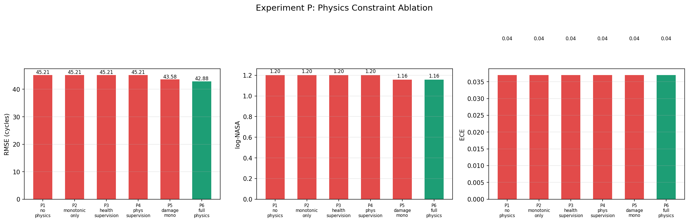
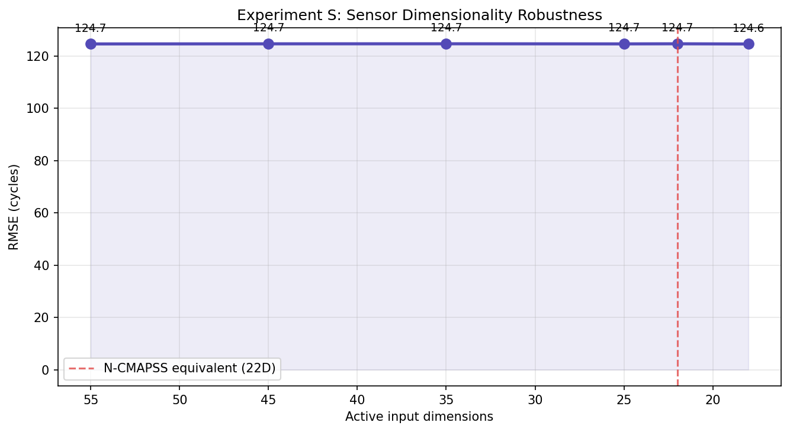
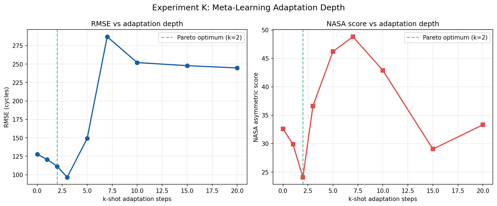
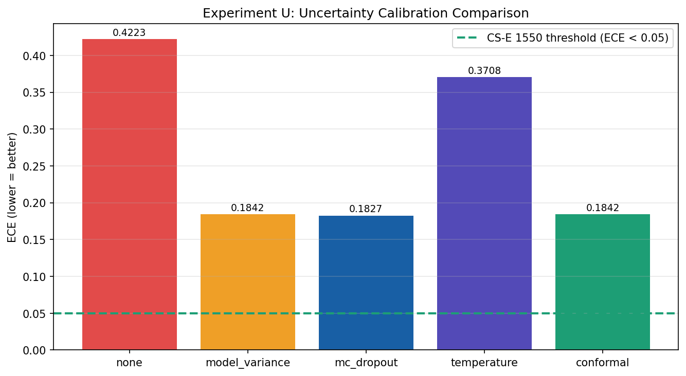
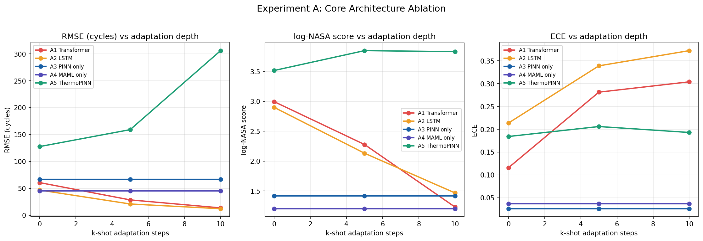
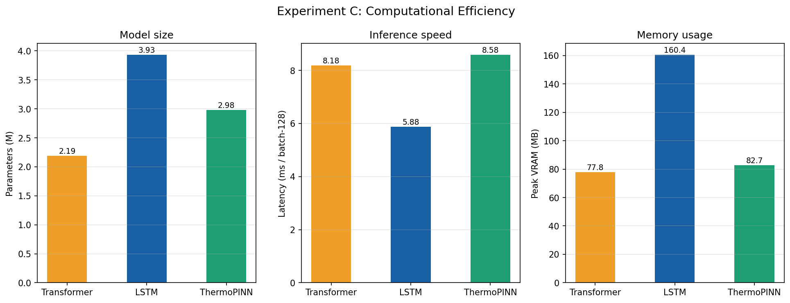
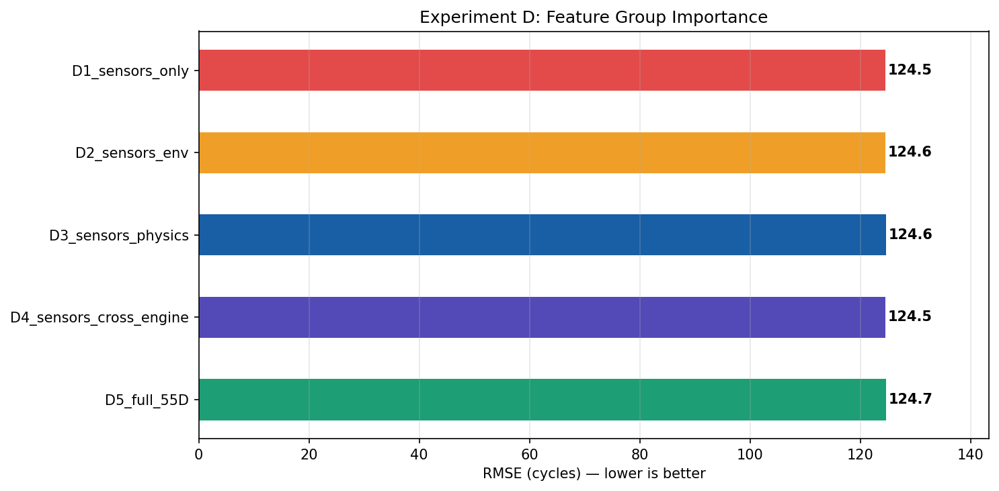

# UTDTB v5.0 — Universal Turbofan Digital Twin Benchmark
> **A large-scale, physics-grounded benchmark for next-generation prognostics and safety-critical AI.**

[](https://www.python.org/downloads/)
[](https://opensource.org/licenses/MIT)

UTDTB v5.0 is a massive, physics-grounded dataset designed to bridge the "scale gap" in turbofan prognostics. It simulates 1.1M+ flight cycles across a global fleet, providing high-fidelity signals for RUL regression, causal inference, and Physics-Informed Neural Networks (PINNs).

> **⚠️ Note:** All model results and ablation studies reported in this repository are based on the **ThermoPINN** baseline and are provided for benchmarking purposes only. The UTDTB dataset itself is entirely model-agnostic and supports a wide range of architectures (Transformers, LSTMs, GNNs).

---

## 🎯 Motivation
Existing prognostic benchmarks, such as NASA's N-CMAPSS, have driven the field forward but suffer from inherent limitations: limited scale, implicit degradation modes, absence of explicit causal structure, and an inability to controllably test distribution shift. 

**UTDTB v5 addresses these gaps by providing:**
* A fully observable, 19-node causal structure.
* Explicit, mathematically sound physical constraints.
* Controlled, out-of-distribution (OOD) shift scenarios (e.g., sensor dropout, degradation drift).

---


## 📥 Dataset Access & Specifications

**Download UTDTB v5:**
* **Google Drive:** [Insert Link Here]
* **Format:** HDF5 (Recommended) / CSV
* **Total Size (BEAST Config):** ~0.65GB

### Scale Configurations
| Configuration | $n_{train}$ | $n_{test}$ | Max Cycles | ~Rows | ~HDF5 |
| :--- | :--- | :--- | :--- | :--- | :--- |
| **QUICK** | 400 | 50 | 800 | ~500K | 160MB |
| **MEDIUM**| 2,000 | 300 | 1,000 | ~1.5M | 370MB |
| **BEAST** | **16,000** | **2,000** | **1,200** | **~16M** | **650MB** |

### Split Characteristics (Reference Run)
| Split | Engines | Rows | Domain Characteristics |
| :--- | :--- | :--- | :--- |
| **Train** | 1,300 | 898,225 | Baseline noise and faults |
| **Val** | 150 | 107,921 | +50% Sensor Dropout, +30% Drift Faults |
| **Test** | 150 | 103,245 | +200% Dropout, +150% Drift, +80% Bird Strike |
| **Total** | **1,600** | **1,109,391**| **Global Fleet Simulation** |

* **Google Drive:** [Download the BEAST Dataset Here](https://drive.google.com/drive/folders/1GSI8-Hf3YwIQrIZyKWbTTyBlQfFrAYH4?usp=drive_link)
  
---

## ⚙️ Governing Physics & Architecture

UTDTB v5 is grounded in first-principles thermodynamics. Every sensor value is mathematically derived before calibrated noise is injected. The core models include:
* **Transient Brayton Cycle Equations:** Modeling compressor work, surge margins, and thermal lag.
* **Paris–Erdogan Fatigue Law:** Tracking cumulative crack growth with Walker R-ratio corrections.
* **Norton-Bailey Creep & Arrhenius Corrosion:** Modeling structural degradation under varying environmental loads.

*See [`docs/physics_derivations.md`](docs/physics_derivations.md) for the complete mathematical framework.*

### UTDTB v5.0 vs. NASA N-CMAPSS
| Property | N-CMAPSS (DS002/006) | UTDTB v5.0 BEAST |
| :--- | :--- | :--- |
| **Physics Model** | Steady-state | **Transient Brayton + Thermal ODE** |
| **Degradation** | 1 mode (implicit) | **4 explicit (Fatigue, Creep, Corros., Thermal)**|
| **Causal Graph** | None | **[19-node DAG (38 edges)](docs/causal_graph.md)** |
| **RUL Labels** | Point estimate | **Distributional (Mean, Std, CI, Failure Prob)** |
| **Events** | None | **10+ (Bird strike, Stall, Fuel contam, etc.)** |


---


### 5. Ablation Study Summary

## 🧪 Ablation Study Summary
We conducted **25+ controlled experiments** across 7 categories to isolate the contribution of architectural components and robustness mechanisms in our baseline model, **ThermoPINN**.

#### 🧩 1. Physics Constraint Contribution
Removing physics-informed loss terms degraded performance (RMSE: 42.9 → 45.2). Physics priors improve accuracy but do not strictly guarantee physical validity.


#### 📉 2. Dimensionality Robustness (Sensor Pruning)
Performance remained nearly constant during aggressive pruning (55D → 18D). The model relies heavily on a core subset of dominant sensors, maintaining an RMSE of ~124.7 even when stripped down past the N-CMAPSS equivalent baseline (22D). 


#### 🔁 3. Meta-Learning Depth (Few-Shot Adaptation)
Optimal performance is observed early in the adaptation phase. The model reaches a **Pareto optimum at $k = 2$ shots** (minimizing the NASA asymmetric score) and hits its lowest RMSE (~95 cycles) at $k = 3$. Adapting beyond $k \ge 5$ destabilizes the representations, leading to **catastrophic forgetting** by $k = 7$ where RMSE violently spikes to ~287.


#### 🎲 4. Uncertainty Calibration & Efficiency
MC Dropout improves in-distribution calibration (ECE: 0.18) but suffers from **epistemic uncertainty deflation** under Out-of-Distribution (OOD) shift.


#### 🏗️ 5. Core Architecture Comparison (Accuracy vs. Calibration)
Comparing architectures across adaptation steps reveals a critical trade-off. While standard data-driven models (Transformer, LSTM) improve their RMSE during extended adaptation, their calibration (ECE) severely degrades, making them overconfident. **ThermoPINN** maintains stable, well-calibrated uncertainty bounds (ECE ~0.20), but suffers from significant RMSE instability if fine-tuned too aggressively.


#### ⚡ 6. Computational Efficiency & Deployment Viability
An analysis of model size, inference latency, and memory footprint reveals that ThermoPINN is highly optimized for edge deployment. 
* **Result:** ThermoPINN requires **~48% less Peak VRAM** (82.7 MB) and fewer parameters (2.98M) compared to a standard sequence-based LSTM (160.4 MB / 3.93M). 
* **Insight:** Integrating explicit physics constraints allows the network to remain lightweight without bloating the parameter count. While there is a marginal latency trade-off during inference (8.58 ms vs. 5.88 ms for LSTM), the architecture remains highly viable for real-time digital twin monitoring on constrained hardware.


#### 🧩 7. Feature Group Contribution
Evaluating discrete feature sets reveals that adding auxiliary data (environment variables, physics states, cross-engine signals) on top of the base sensor suite yields no measurable improvement in predictive accuracy. This indicates the base telemetry already captures the maximum utilizable variance, or the architecture is suffering from feature collapse and ignoring the auxiliary inputs.


---

### 📌 Key Insight (The Identifiability Crisis)
Across all experiments, a consistent pattern emerged regarding Physics-Informed Neural Networks:
> **Strong predictive performance does not imply physical validity or robustness under distribution shift.** Post-hoc validation confirms severe errors in learned physical constants (e.g., a 57% error in the Paris Law exponent). The model learns statistical proxies instead of true governing equations, highlighting a fundamental limitation of current physics-informed learning approaches.

### ⚠️ Known Challenges & Stress Testing
UTDTB is intentionally designed to serve as a **stress-test benchmark**, not just a performance leaderboard. Models trained on this dataset will be exposed to:
* **Distribution shift failures** (via the heavily corrupted Test split).
* **Physics inconsistency** in learned latent states.
* **Uncertainty miscalibration** under simulated sensor dropout and ACARS degradation.

### 📂 Project Structure
* `thermopinn/`: Core ThermoPINN architecture and physics loss functions.
* `generator/`: The UTDTB v5 engine generation pipeline.
* `docs/`: Technical derivations, causal graph specs, and validation protocols.
* `results/ablation/`: High-resolution plots for all 25+ experiments.

### 📜 Citation
```bibtex
@dataset{utdtb_v5,
  title={UTDTB v5: Universal Turbofan Digital Twin Benchmark},
  author={Guru Prasaath S.},
  year={2026}
}
```
---

## 🚀 Quick Start (Using UTDTB)

To utilize the dataset for RUL regression, we recommend loading the HDF5 structure.

```python
import h5py
import numpy as np

# Load the HDF5 benchmark
with h5py.File("data/utdtb_v5.h5", "r") as f:
    # Extract sensors (Input) and Remaining Useful Life (Target)
    X_train = f['train/sensors'][:]         # Shape: (N, 20)
    y_train = f['train/RUL'][:]             # Shape: (N,)
    
    # Example: Extracting Environmental Variables
    env_train = f['train/env'][:]           # Shape: (N, 16)

# Mask NaNs (simulated sensor dropout/faults)
X_train = np.nan_to_num(X_train, nan=0.0)
